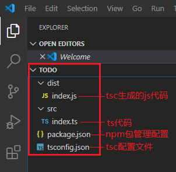

# TypeScript项目创建流程和结构

- [1.1. 前置需求](#11-前置需求)
- [1.2. TypeScript项目简易创建流程](#12-typescript项目简易创建流程)
- [1.3. 图解项目结构](#13-图解项目结构)

## 1.1. 前置需求
- 安装VS Code
- 安装Node.js

## 1.2. TypeScript项目简易创建流程
1. 创建项目目录，如**todo**；
2. 创建**packages.json**文件
   - 在**todo**目录下执行命令：**npm init --yes**
3. 安装typescript
   - **npm install --save-dev typescript@3.5.1**
   - (可选)**npm install --save-dev tsc-watch@2.1.2**
4. 创建tsc编译器配置文件
   - 在**todo**目录下创建**tsconfig.json**文件
   - 输入以下内容：
    ```json
    {
        "compilerOptions": {
            "target": "es2018",
            "outDir": "./dist",
            "rootDir": "./src",
            "module": "commonjs"
        }
    }
    ```
    - 更多配置选项，请参考[这里](https://www.typescriptlang.org/docs/handbook/tsconfig-json.html)
5. 编写ts源代码
   - 创建源代码目录：**todo/src**
   - 在源代码目录里创建**index.ts**文件
     - 输入以下内容
        ```typescript
        console.log("Hello World!");
        ```
6. 编译ts代码
    - 在项目根目录里执行命令：**tsc**
      - 这会在**todo/dist**目录中生成**index.ts**对应的js代码**index.js**
7. 运行js代码
   - 执行命令：**node dist/index.js**
     - 这会让node的javascript运行环境去执行index.js里的代码
   - 结果显示为：**Hello,World!**

## 1.3. 图解项目结构
