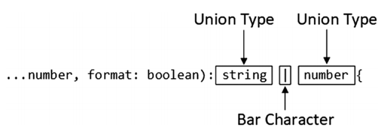
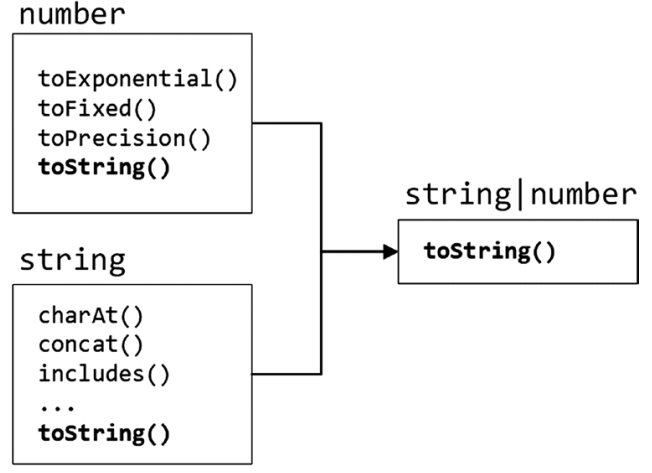

# 联合类型（Type Unions）

- [1.1. 简介](#11-简介)
- [1.2. 基本语法](#12-基本语法)
- [1.3. 联合类型的共用属性和方法](#13-联合类型的共用属性和方法)

## 1.1. 简介
- 使用单个的类型注释太过于限制，而使用any类型又过于灵活而容易出现错误
- 在两者之间，TypeScript提供type unions来指定一个类型集合
## 1.2. 基本语法
- 使用 **|** 分隔多个类型，例如 **function foo(): number|string|boolean {}**

## 1.3. 联合类型的共用属性和方法
- 对于联合类型，只能使用所有类型共用的属性和方法

