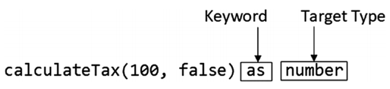

# 类型断言（Type Assertions）

- [1.1. 简介](#11-简介)
- [1.2. 基本语法](#12-基本语法)
- [1.3. 意想不到的类型的断言](#13-意想不到的类型的断言)
  - [1.3.1. 示例](#131-示例)
  - [1.3.2. any断言](#132-any断言)
- [1.4. 类型断言的另一种写法](#14-类型断言的另一种写法)
- [1.5. 非空断言（non-null assertion）](#15-非空断言non-null-assertion)
- [1.6. 明确赋值断言（Definite Assignment Assertion）](#16-明确赋值断言definite-assignment-assertion)


## 1.1. 简介
- 类型断言告诉tsc对待一个值作为一个特定的类型，成为类型窄化（type narrowing）
- 类型断言是窄化联合类型的方法中的一种
## 1.2. 基本语法
- 使用 **as** 关键词，例如 **let sum = add(100, 'hello') as number;**



## 1.3. 意想不到的类型的断言
- tsc会检查类型断言是否符合要求
- 对于联合类型，如果断言的类型不是联合中的一个，在编译阶段tsc就会报错
### 1.3.1. 示例
  ```typescript
    function add(add1:number, add2:number): number|string {
        return add1 + add2;
    }
    let add1 = 10;
    let add2 = 20;
    let sum = add(add1, add2) as boolean; // boolean不在number|string里，所以会报错
    console.log('sum=' + sum);
  ```
  报错信息为：
    - src/index.ts:6:11 - error TS2352: Conversion of type 'string | number' to type 'boolean' may be a mistake because neither type sufficiently overlaps with the other. If this was intentional, convert the expression to 'unknown' first.
    - Type 'number' is not comparable to type 'boolean'.
  ### 1.3.2. any断言
  - 要想使得上述的示例通过编译，可以先断言至any类型，然后断言至想要的类型
    ```typescript
    let sum = add(add1, add2) as any as boolean;
    ```
## 1.4. 类型断言的另一种写法
- 除了使用**any**关键词之外，还可以使用 **尖括号"<>"** 来进行类型断言
    ```typescript
    let sum = <boolean>add(add1, add2);
    ```
- The problem with this syntax is that it cannot be used in **TSX/JSX** files, which combine HTML elements with TypeScript/JavaScript code and are commonly used in React development. For this reason, the as keyword is the preferred way to assert types.

## 1.5. 非空断言（non-null assertion）
- 参考[Nullable类型章节里的非空断言](06.Nullable类型.md#1331-非空断言non-null-assertion移除联合类型中的null)

## 1.6. 明确赋值断言（Definite Assignment Assertion）
- 参考[Nullable类型章节的明确赋值断言](06.Nullable类型.md#14-明确赋值断言definite-assignment-assertion)