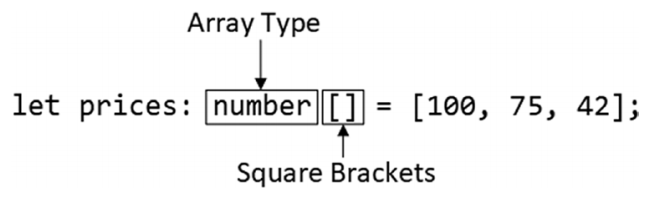

# 数组（Arrays）

- [1.1. 基本语法](#11-基本语法)
  - [1.1.1. 示例](#111-示例)
- [1.2. 多类型的数组](#12-多类型的数组)
  - [1.2.1. 示例](#121-示例)
- [1.3. 另一种可选的语法](#13-另一种可选的语法)
  - [1.3.1. 示例](#131-示例)
- [1.4. 数组的推断类型](#14-数组的推断类型)
  - [1.4.1. 示例](#141-示例)
  - [1.4.2. 避免推断的数组类型所产生的问题](#142-避免推断的数组类型所产生的问题)
  - [1.4.3. 避免空数组产生的问题](#143-避免空数组产生的问题)

## 1.1. 基本语法
- JavaScript数组可以包含任意的类型，并拥有可变的长度
- TypeScript不改变数组长度的灵活变动，但是使用类型注释对数组里的类型进行了限制
### 1.1.1. 示例
```typescript
let prices: number[] = [100, 75, 42];
let names: string[] = ["Hat", "Gloves", "Umbrella"];
```


## 1.2. 多类型的数组
- 结合联合类型，可以实现一个数组的每个值具有多个可能的类型
### 1.2.1. 示例
```typescript
let prices: (number|string)[] = [100, '75', '42'];
```

## 1.3. 另一种可选的语法
- 使用 **Array\<type\>** 作为类型注释
### 1.3.1. 示例
```typescript
let prices: number[] = [100, 75, 42];
// statement above is equivalent to this statement:
let prices:Array<number> = [100, 75, 42];
```

## 1.4. 数组的推断类型
- 当没有显示的使用数组类型注释时，tsc可以自动推断数组的类型
### 1.4.1. 示例
```typescript
let prices = [100, 75, 42]; // prices被推断为number[]类型
```
### 1.4.2. 避免推断的数组类型所产生的问题
- 考虑下面的情况：
    ```typescript
    function printPrice(price: number) {
        console.log(price.toFixed(2));
    }

    let prices = [100, 75, 42, "20"]; // 不小心混入了一个string类型的值
    prices.forEach((price, index) => printPrice(price)); // Error: Argument of type 'string | number' is not assignable to parameter of type 'number'.Type 'string' is not assignable to type 'number'.ts(2345)
    ```

- 解决方法：**显示的声明数组类型**，如：
    ```typescript
    let prices:number[] = [100, 75, 42, "20"]; // tsc会高亮错误的地方:"20"
    ```

### 1.4.3. 避免空数组产生的问题
- 对于空数组，tsc会自动推断该数组类型为any，例如
    ```typescript
    let prices = []; // prices的类型为any[]
    ```
- 以上的情况可能会导致意外，解决方法：**显示的声明数组类型**