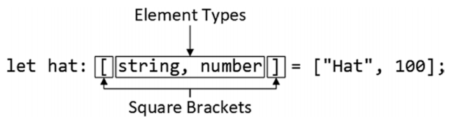

# 元组（Tuples）

- [1.1. 基本语法](#11-基本语法)
- [1.2. 处理元组](#12-处理元组)
  - [1.2.1. 示例](#121-示例)
- [1.3. 使用元组](#13-使用元组)
  - [1.3.1. 元组数组](#131-元组数组)
  - [1.3.2. 作为联合类型里的一个类型](#132-作为联合类型里的一个类型)

## 1.1. 基本语法
- 元组是定长数组，数组内的每个元素可以有特定的不同类型
- 基本语法：**let john: [string, number] = ["John", 28];**
  

## 1.2. 处理元组
- 遍历元组里每个元素时，需要使用对应的联合类型
### 1.2.1. 示例
```typescript
let john: [string, number] = ["John", 28];

john.forEach((val:string|number) =>{ // 即使不显示注释类型，val也会被自动推断为string|number
    if (typeof val === 'string') { // 使用类型守卫来窄化类型
        console.log('Name is ' + val);
    } else {
        console.log('Age is ' + val);
    }
});
```

## 1.3. 使用元组
- 元组可以像其他任意类型一样来使用，例如创建元组数组，在联合类型里使用元组
### 1.3.1. 元组数组
```typescript
let john: [string, number] = ["John", 28];
let peoples: [string, number][] = [john, ['Peter',35]]; 
```
### 1.3.2. 作为联合类型里的一个类型
```typescript
let peopleOrBoolean: ([string, number] | boolean)[] = [true, false, john, ['Jacob', 54], ...peoples];
```