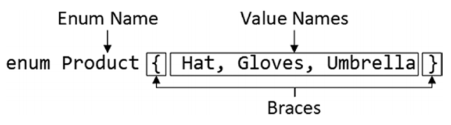

# 枚举（Enums）

- [1.1. 基本语法](#11-基本语法)
  - [1.1.1. 示例](#111-示例)
- [1.2. 理解枚举是如何工作的](#12-理解枚举是如何工作的)
- [1.3. 使用指定的枚举值](#13-使用指定的枚举值)
- [1.4. 使用字符串枚举](#14-使用字符串枚举)
- [1.5. 理解枚举的限制](#15-理解枚举的限制)
  - [1.5.1. 类型检查限制](#151-类型检查限制)
    - [1.5.1.1. 示例](#1511-示例)
  - [1.5.2. 类型守卫限制](#152-类型守卫限制)
  - [1.5.3. 使用常量枚举（Const Enums）](#153-使用常量枚举const-enums)

## 1.1. 基本语法
- 使用 **enum** 和 **{}**
### 1.1.1. 示例
```typescript
enum Names { John, Peter, Jacob }
let peoples: [Names, number][] = [[Names.Jacob, 18], [Names.Peter, 29]];
```


## 1.2. 理解枚举是如何工作的
- 枚举并不是一种新的类型，而是利用TypeScript的类型检查和标准JavaScript功能来实现的
- 在编译之后的JavaScript代码内部，每个枚举值都有对应的从0（默认情况）开始的数值，整个枚举类型其实就是一个object
  - TypeScript示例代码：
    ```typescript
    enum Names { John, Peter, Jacob }
    let peoples: [Names, number][] = [[Names.Jacob, 18], [Names.Peter, 29]];
    ```
  - 编译之后的JavaScript代码：
    ```javascript
    var Names;
    (function (Names) {
        Names[Names["John"] = 0] = "John";
        Names[Names["Peter"] = 1] = "Peter";
        Names[Names["Jacob"] = 2] = "Jacob";
    })(Names || (Names = {}));
    let peoples = [[Names.Jacob, 18], [Names.Peter, 29]];
    ```

## 1.3. 使用指定的枚举值
- 默认情况下，枚举值是从0开始的数值
  - TypeSCript代码：
    ```typescript
    enum Names { John, Peter, Jacob }
    ```
  - 对应地声明文件代码：
    ```typescript
    declare enum Names {
        John = 0,
        Peter = 1,
        Jacob = 2
    }
    ```
- 可以给枚举定义一个特定地值
  - TypeSCript代码：
    ```typescript
    enum Names { John, Peter=20, Jacob }
    enum OtherNames { Smith=Names.Peter+1, David=Names.John+Smith }
    ```
  - 对应地声明文件代码：
    ```typescript
    declare enum Names {
        John = 0,
        Peter = 20,
        Jacob = 21
    }
    declare enum OtherNames {
        Smith = 21,
        David = 21
    }
    ```

## 1.4. 使用字符串枚举
- 字符串枚举的每个枚举值都必须被赋值为string
- TypeScript代码：
    ```typescript
    enum Names { John="John Connor", Peter="Peter Smith" }
    ```
- 对应的声明文件代码：
    ```typescript
    declare enum Names {
        John = "John Connor",
        Peter = "Peter Smith"
    }
    ```
- 对应的JavaScript代码：
    ```javascript
    var Names;
    (function (Names) {
        Names["John"] = "John Connor";
        Names["Peter"] = "Peter Smith";
    })(Names || (Names = {}));
    ```

## 1.5. 理解枚举的限制
### 1.5.1. 类型检查限制
- 使用数值型的枚举时，tsc不会阻止任意的数值赋值给枚举值
#### 1.5.1.1. 示例
```typescript
enum Names { John, Peter=20, Jacob }
let peopleName:Names = 100; // OK
```
### 1.5.2. 类型守卫限制
- 数值型的枚举的内部实现机制是使用JavaScript的**number**，所以无法使用**typeof**区分**numbers**和**enums**

### 1.5.3. 使用常量枚举（Const Enums）
- 枚举内部的实现是通过创建一个object，可能会影响性能
- 使用const枚举可以避免这个问题，但是这是一个高级特性，在大多数项目中很少需要。
  - TypeScript代码：
    ```typescript
    const enum Names { John, Peter=20, Jacob }
    let peopleName:Names = Names.John;
    ```
  - 对应的JavaScript代码：
    ```javascript
    let peopleName = 0 /* John */;
    ```
- const枚举无法通过索引查找对应的字符串值
    ```typescript
    const enum Names { John, Peter=20, Jacob }
    let peopleName:Names = Names[0]; // Error: A const enum member can only be accessed using a string literal.ts(2476)
    ```
- **preserveConstEnums**编译器选项告诉tsc即使是常量枚举也要创建object
  - 这个功能只是为了测试
  - 不会恢复索引查找功能