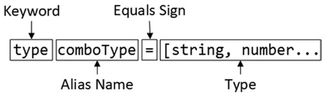

# 类型别名（Type Aliases）

- [1.1. 基本语法](#11-基本语法)
  - [1.1.1. 示例](#111-示例)

## 1.1. 基本语法
- 为了避免重复，TypeScript提供了**类型别名**特性，允许为自定义类型组合分配一个名称
### 1.1.1. 示例
```typescript
enum City { London = "LON", Paris = "PAR", Chicago = "CHI" }
type comboType = [string, number | true, 1 | 2 | 3 | City.London][];
```
