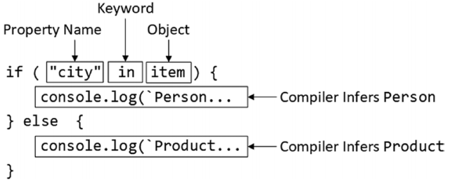
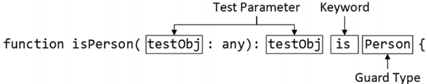

# 对象的类型保护（Type Guard for Objects）

- [1.1. 对象的类型保护](#11-对象的类型保护)
  - [1.1.1. 对象属性的类型保护](#111-对象属性的类型保护)
    - [1.1.1.1. 示例](#1111-示例)
  - [1.1.2. 使用类型谓语函数（Type Predicate Function）进行类型保护](#112-使用类型谓语函数type-predicate-function进行类型保护)
    - [1.1.2.1. 示例](#1121-示例)

## 1.1. 对象的类型保护
- 使用**typeof**可以区分JavaScript不同的基本类型，然而这不适用于object，因为**typeof SomeObject**返回同样的结果：**"object"**

### 1.1.1. 对象属性的类型保护
- 使用 **in** 关键词判断对象里是否拥有某个属性
#### 1.1.1.1. 示例
```typescript
type Product = {
    id: number,
    name: string,
    price: number
};
type Person = {
    id: number,
    name: string,
    age: number
}

let hat: Product = { id: 1001, name: 'Hat', price: 100 };
let john: Person = { id: 2001, name: 'John', age: 18 };
let products: (Product | Person)[] = [hat, john];

products.forEach(item => {
    if ('age' in item) {
        console.log(item.age); // tsc推断item是Person
    } else {
        console.log(item.price); // tsc推断item是Product
    }
});
```


### 1.1.2. 使用类型谓语函数（Type Predicate Function）进行类型保护
- **in**是JavaScript内置的特性，此外TypeScript提供了另一种特性：类型谓语函数
#### 1.1.2.1. 示例
```typescript
type Product = {
    id: number,
    name: string,
    price: number
};
type Person = {
    id: number,
    name: string,
    age: number
}

let hat: Product = { id: 1001, name: 'Hat', price: 100 };
let john: Person = { id: 2001, name: 'John', age: 18 };
let products: (Product | Person)[] = [hat, john];

function isPerson(testObj: any): testObj is Person { // 类型谓语函数
    return testObj.age !== undefined; // true:testObj就是Person
}

products.forEach(item => {
    if (isPerson(item)) {
        console.log(item.age); // tsc推断item是Person
    } else {
        console.log(item.price); // tsc推断item是Product
    }
});
```
