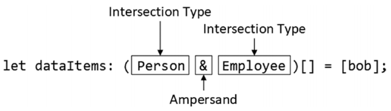
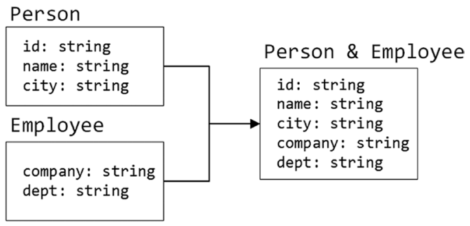
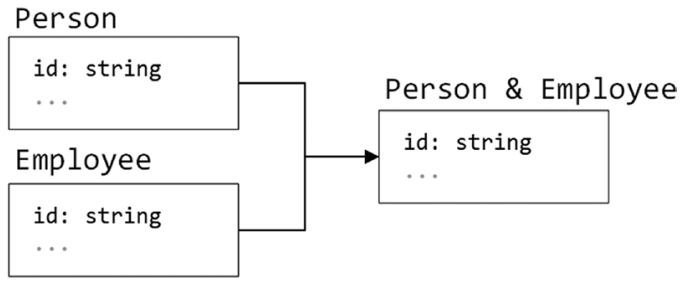
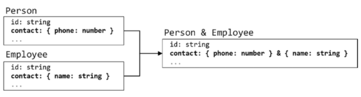
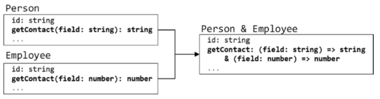

# 交叉类型（Type Intersecitons）

- [1.1. 交叉类型（Type Intersecitons）](#11-交叉类型type-intersecitons)
  - [1.1.1. 示例](#111-示例)
  - [1.1.2. 理解类型交叉是如何合并的](#112-理解类型交叉是如何合并的)
    - [1.1.2.1. 合并相同名字相同类型的属性](#1121-合并相同名字相同类型的属性)
    - [1.1.2.2. 合并相同名字不同类型的属性](#1122-合并相同名字不同类型的属性)
    - [1.1.2.3. 合并方法](#1123-合并方法)

## 1.1. 交叉类型（Type Intersecitons）
- 在不使用类型保护的情况下，联合类型只能访问共用的属性和方法
- 与联合类型不同的是，交叉类型合并了所有的属性和方法
### 1.1.1. 示例
```typescript
type Person = {
    id: string,
    name: string,
    city: string
};
type Employee = {
    company: string,
    dept: string
};
let bob: Person & Employee = {  // Type Intersection
    id: "bsmith", name: "Bob", city: "London", company: "Acme Co", dept: "Sales"
};
let dataItems: (Person & Employee)[] = [bob]; // Type Intersection
dataItems.forEach(item => {
    console.log(`Person: ${item.id}, ${item.name}, ${item.city}`);
    console.log(`Employee: ${item.id}, ${item.company}, ${item.dept}`);
});
```


类型交叉之后的结果：


### 1.1.2. 理解类型交叉是如何合并的
#### 1.1.2.1. 合并相同名字相同类型的属性
  
#### 1.1.2.2. 合并相同名字不同类型的属性
  
  
#### 1.1.2.3. 合并方法
  